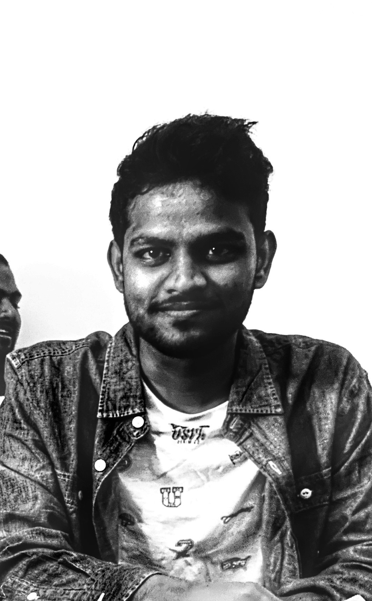

<!--  -->

Hello there! I am Mallikarjuna, my friends and colleagues call me as Arjun. I'm a Research Assistant at [Indian School of Business](https://www.isb.edu/en.html). Before joining at ISB, I worked at [Spacept](https://spacept.com/), [Indian Institute of Technology Madras](https://www.iitm.ac.in/), [Indian Institue of Management Bangalore](https://www.iimb.ac.in/home) and graduated from [R.V.R. & J.C. College of Engineering](https://rvrjcce.ac.in/)

My research interests include Deep Learning, Computer Vision, NLP, and Generative Models, also I have minor interests in Cognitive Sciences. Currently, I am working with [Prof. Sumeet Kumar](https://sumeetkumar.in/) and [Prof. Ashique KhudaBukhsh](https://www.cs.cmu.edu/~akhudabu/) on projects related to AI for Social Good. If you are looking for mentorship to pursue a career in AI feel free to email happy to help :)
